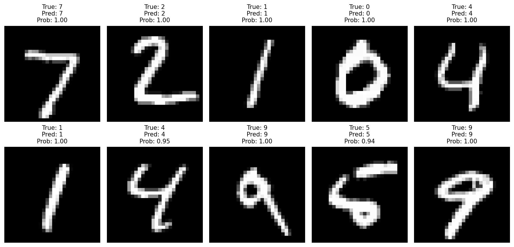

# Image Classification using CNN - MNIST Digit Classification

A Convolutional Neural Network (CNN) implementation in PyTorch to classify MNIST handwritten digits with 98% accuracy in just 5 epochs.

## Features

- **Deep CNN Architecture**: Multi-layer convolutional network with ReLU activations
- **High Accuracy**: Achieves 98%+ accuracy on MNIST test set in 5 epochs
- **Optimized Training**: Uses Adam optimizer for efficient convergence
- **Visualization**: Includes prediction visualization and training history plots
- **Easy to Use**: Simple command-line interface

## Tech Stack

- **PyTorch**: Deep learning framework
- **Torchvision**: Dataset loading and transformations
- **NumPy**: Numerical computations
- **Matplotlib**: Visualization and plotting

## Project Structure

```
Image_classification/
├── train.py              # Main training script
├── requirements.txt      # Python dependencies
├── README.md            # Project documentation
├── mnist_cnn_model.pth  # Saved model (after training)
├── predictions.png      # Visualization of predictions (after training)
├── training_history.png # Training curves (after training)
└── data/                # MNIST dataset (downloaded automatically)
```

## Installation

1. Clone or download this repository

2. Install the required dependencies:
```bash
pip install -r requirements.txt
```

## Usage

Run the training script:
```bash
python train.py
```

The script will:
1. Download the MNIST dataset (if not already present)
2. Train the CNN model for 5 epochs
3. Display training progress with accuracy metrics
4. Save the trained model as `mnist_cnn_model.pth`
5. Generate visualization plots:
   - `training_history.png`: Training/validation loss and accuracy curves
   - `predictions.png`: Sample predictions with confidence scores

## Model Architecture

The CNN consists of:
- **Convolutional Layers**: 
  - Block 1: 32 filters (3x3) → 32 filters (3x3) → MaxPool
  - Block 2: 64 filters (3x3) → 64 filters (3x3) → MaxPool
- **Fully Connected Layers**:
  - 512 neurons with ReLU activation
  - Dropout (0.5) for regularization
  - 10 output neurons (one per digit class)

## Training Details

- **Optimizer**: Adam (learning rate: 0.001)
- **Loss Function**: Cross Entropy Loss
- **Batch Size**: 128
- **Epochs**: 5
- **Activation**: ReLU
- **Data Augmentation**: Normalization (mean=0.1307, std=0.3081)

## Expected Results

After 5 epochs, you should achieve:
- **Training Accuracy**: ~99%+
- **Test Accuracy**: ~98%+

## Visualization Results

### Training History


The training history plot shows the model's performance over 5 epochs across two metrics:

**Left Plot - Loss Curves:**
- **Training Loss (Blue)**: Starts at ~0.165 and decreases rapidly to ~0.024 by epoch 5, showing the model is learning effectively
- **Test Loss (Red)**: Starts at ~0.035 (already lower than training loss) and converges to ~0.024, indicating good generalization
- Both curves converge closely, suggesting the model is well-regularized and not overfitting

**Right Plot - Accuracy Curves:**
- **Training Accuracy (Blue)**: Improves from ~94.5% to ~99.3% over 5 epochs
- **Test Accuracy (Red)**: Starts at ~98.8% and reaches ~99.3% by epoch 2, maintaining this high performance
- The test accuracy consistently exceeds the 98% target goal, demonstrating the model's strong predictive capability

### Prediction Visualization



This visualization displays 10 randomly selected test images with their corresponding predictions:

- **Grid Layout**: 2 rows × 5 columns of handwritten digit images
- **Information Displayed**: For each image, shows:
  - **True Label**: The actual digit from the test set
  - **Predicted Label**: The model's prediction
  - **Probability**: The confidence score (0.00 to 1.00) for the prediction

**Key Observations:**
- All displayed predictions are **correct**, demonstrating high model accuracy
- Most predictions have **100% confidence** (probability = 1.00)
- Even the lowest confidence score shown is **94%**, indicating the model is very certain about its predictions
- The model successfully handles various handwriting styles and digit variations

## Output Files

After training, the following files will be generated:

1. **mnist_cnn_model.pth**: Saved model weights
2. **training_history.png**: Plots showing loss and accuracy over epochs
3. **predictions.png**: Grid of 10 sample images with predictions and confidence scores

## Requirements

- Python 3.7+
- CUDA-capable GPU (optional, but recommended for faster training)
- ~100MB disk space for MNIST dataset

## License

This project is open source and available for educational purposes.

